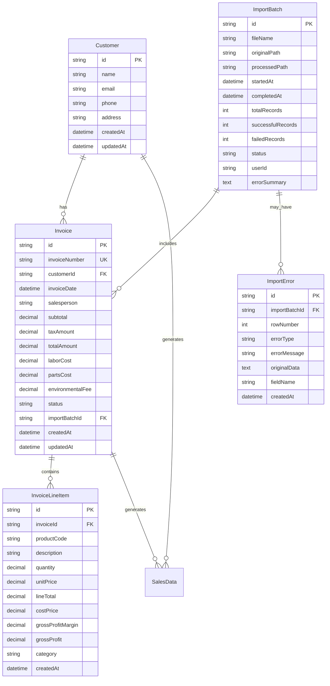

# Data Model: Invoice CSV Import and Data Management

**Date**: 2025-11-20
**Feature**: Invoice CSV Import and Data Management
**Phase**: 1 - Data Model Design

## Overview

This document defines the data model for importing TireMaster invoice CSV data and integrating it with the existing sales analytics system. The model supports customer management, invoice tracking, line item details, and audit trails.

## Entity Relationships



## Core Entities

### 1. Customer

Represents customers from TireMaster invoice data with normalized contact information.

**Fields**:
- `id`: UUID primary key
- `name`: Full customer name from invoice
- `email`: Customer email address (optional)
- `phone`: Customer phone number (optional)
- `address`: Full address string (optional)
- `customerCode`: TireMaster customer identifier (optional)
- `createdAt`: Record creation timestamp
- `updatedAt`: Last modification timestamp

**Validation Rules**:
- Name is required and must be 1-255 characters
- Email must be valid format if provided
- Phone must be valid format if provided
- Duplicate prevention based on normalized name

**Relationships**:
- One-to-many with Invoice
- One-to-many with SalesData (through invoices)

### 2. Invoice

Represents complete invoice transactions from TireMaster CSV data.

**Fields**:
- `id`: UUID primary key
- `invoiceNumber`: Unique invoice identifier from TireMaster
- `customerId`: Foreign key to Customer
- `invoiceDate`: Date of the invoice transaction
- `salesperson`: Salesperson name from invoice
- `subtotal`: Pre-tax total amount
- `taxAmount`: Total tax charged
- `totalAmount`: Final invoice total
- `laborCost`: Total labor charges (optional)
- `partsCost`: Total parts charges (optional)
- `environmentalFee`: Environmental disposal fees (optional)
- `status`: Invoice status (ACTIVE, VOIDED, RETURNED)
- `importBatchId`: Foreign key to ImportBatch
- `createdAt`: Record creation timestamp
- `updatedAt`: Last modification timestamp

**Validation Rules**:
- Invoice number must be unique
- Invoice date cannot be in future
- All monetary amounts must be non-negative
- Subtotal + tax should equal total amount
- Customer must exist

**Relationships**:
- Many-to-one with Customer
- One-to-many with InvoiceLineItem
- Many-to-one with ImportBatch

**Business Rules**:
- Invoice numbers follow TireMaster format: `YYYY-NNNNN`
- Supports invoice updates through re-import
- Maintains audit trail of modifications

### 3. InvoiceLineItem

Represents individual products/services sold within an invoice.

**Fields**:
- `id`: UUID primary key
- `invoiceId`: Foreign key to Invoice
- `productCode`: TireMaster product/service code
- `description`: Product/service description
- `quantity`: Quantity sold
- `unitPrice`: Price per unit
- `lineTotal`: Total for this line (quantity × unit price)
- `costPrice`: Cost basis for this item
- `grossProfitMargin`: Calculated profit margin percentage
- `grossProfit`: Calculated profit amount
- `category`: Product category (TIRES, SERVICES, PARTS, FEES)
- `createdAt`: Record creation timestamp

**Validation Rules**:
- Quantity must be positive
- Unit price must be non-negative
- Line total should equal quantity × unit price
- Gross profit margin should be calculated as (lineTotal - costPrice) / lineTotal
- Category must be valid enum value

**Relationships**:
- Many-to-one with Invoice

**Business Rules**:
- Line items cannot be modified after invoice creation
- Category is auto-determined by product code patterns
- Cost price enables profit analysis

### 4. ImportBatch

Tracks CSV import operations for audit and monitoring purposes.

**Fields**:
- `id`: UUID primary key
- `fileName`: Original CSV file name
- `originalPath`: Full path where file was found
- `processedPath`: Archive path after processing
- `startedAt`: Import start timestamp
- `completedAt`: Import completion timestamp
- `totalRecords`: Total records in CSV file
- `successfulRecords`: Successfully imported records
- `failedRecords`: Records that failed to import
- `status`: Import status (STARTED, IN_PROGRESS, COMPLETED, FAILED)
- `userId`: User who triggered import (for manual imports)
- `errorSummary`: High-level error summary text

**Validation Rules**:
- File name must be provided
- Status must be valid enum value
- Record counts must be non-negative
- Successful + failed should not exceed total

**Relationships**:
- One-to-many with Invoice
- One-to-many with ImportError

**Business Rules**:
- Each CSV file creates one import batch
- Provides complete audit trail of import operations
- Enables import progress tracking

### 5. ImportError

Captures detailed error information for failed import records.

**Fields**:
- `id`: UUID primary key
- `importBatchId`: Foreign key to ImportBatch
- `rowNumber`: Row number in CSV file where error occurred
- `errorType`: Categorized error type (VALIDATION, DUPLICATE, MISSING_DATA, FORMAT)
- `errorMessage`: Human-readable error description
- `originalData`: Raw CSV row data that failed
- `fieldName`: Specific field that caused the error (optional)
- `createdAt`: Error recording timestamp

**Validation Rules**:
- Row number must be positive
- Error type must be valid enum value
- Error message is required
- Original data should be preserved for debugging

**Relationships**:
- Many-to-one with ImportBatch

**Business Rules**:
- Enables detailed error reporting to users
- Supports error pattern analysis
- Facilitates CSV data cleanup

## Integration with Existing Entities

### SalesData Integration

The existing `SalesData` entity will be enhanced to accommodate invoice-sourced data:

**New Fields**:
- `sourceType`: ENUM('TIRE_MASTER_SYNC', 'INVOICE_IMPORT')
- `invoiceId`: Foreign key to Invoice (optional)
- `grossProfitMargin`: Decimal for profit analysis
- `costBasis`: Decimal for cost tracking

**Data Flow**:
1. Invoice import creates Invoice and InvoiceLineItem records
2. Transform service creates corresponding SalesData records
3. Dashboard analytics aggregate both TireMaster sync and invoice import data

## Prisma Schema Updates

```prisma
model Customer {
  id           String   @id @default(cuid())
  name         String   @db.VarChar(255)
  email        String?  @db.VarChar(255)
  phone        String?  @db.VarChar(50)
  address      String?  @db.Text
  customerCode String?  @db.VarChar(100)
  createdAt    DateTime @default(now()) @map("created_at")
  updatedAt    DateTime @updatedAt @map("updated_at")

  // Relationships
  invoices    Invoice[]
  salesData   SalesData[]

  @@unique([name], name: "unique_customer_name")
  @@map("customers")
}

model Invoice {
  id              String   @id @default(cuid())
  invoiceNumber   String   @unique @map("invoice_number") @db.VarChar(50)
  customerId      String   @map("customer_id")
  invoiceDate     DateTime @map("invoice_date")
  salesperson     String   @db.VarChar(255)
  subtotal        Decimal  @db.Decimal(10, 2)
  taxAmount       Decimal  @map("tax_amount") @db.Decimal(10, 2)
  totalAmount     Decimal  @map("total_amount") @db.Decimal(10, 2)
  laborCost       Decimal? @map("labor_cost") @db.Decimal(10, 2)
  partsCost       Decimal? @map("parts_cost") @db.Decimal(10, 2)
  environmentalFee Decimal? @map("environmental_fee") @db.Decimal(10, 2)
  status          InvoiceStatus @default(ACTIVE)
  importBatchId   String   @map("import_batch_id")
  createdAt       DateTime @default(now()) @map("created_at")
  updatedAt       DateTime @updatedAt @map("updated_at")

  // Relationships
  customer     Customer        @relation(fields: [customerId], references: [id])
  lineItems    InvoiceLineItem[]
  importBatch  ImportBatch     @relation(fields: [importBatchId], references: [id])
  salesData    SalesData[]

  @@index([invoiceDate])
  @@index([customerId])
  @@index([importBatchId])
  @@map("invoices")
}

model InvoiceLineItem {
  id                  String  @id @default(cuid())
  invoiceId           String  @map("invoice_id")
  productCode         String  @map("product_code") @db.VarChar(100)
  description         String  @db.Text
  quantity            Decimal @db.Decimal(10, 3)
  unitPrice           Decimal @map("unit_price") @db.Decimal(10, 2)
  lineTotal           Decimal @map("line_total") @db.Decimal(10, 2)
  costPrice           Decimal @map("cost_price") @db.Decimal(10, 2)
  grossProfitMargin   Decimal @map("gross_profit_margin") @db.Decimal(5, 2)
  grossProfit         Decimal @map("gross_profit") @db.Decimal(10, 2)
  category            ProductCategory
  createdAt           DateTime @default(now()) @map("created_at")

  // Relationships
  invoice Invoice @relation(fields: [invoiceId], references: [id])

  @@index([invoiceId])
  @@index([productCode])
  @@index([category])
  @@map("invoice_line_items")
}

model ImportBatch {
  id                String   @id @default(cuid())
  fileName          String   @map("file_name") @db.VarChar(255)
  originalPath      String   @map("original_path") @db.VarChar(500)
  processedPath     String?  @map("processed_path") @db.VarChar(500)
  startedAt         DateTime @default(now()) @map("started_at")
  completedAt       DateTime? @map("completed_at")
  totalRecords      Int      @map("total_records")
  successfulRecords Int      @default(0) @map("successful_records")
  failedRecords     Int      @default(0) @map("failed_records")
  status            ImportStatus @default(STARTED)
  userId            String?  @map("user_id") @db.VarChar(100)
  errorSummary      String?  @map("error_summary") @db.Text

  // Relationships
  invoices     Invoice[]
  errors       ImportError[]

  @@index([startedAt])
  @@index([status])
  @@map("import_batches")
}

model ImportError {
  id             String    @id @default(cuid())
  importBatchId  String    @map("import_batch_id")
  rowNumber      Int       @map("row_number")
  errorType      ErrorType @map("error_type")
  errorMessage   String    @map("error_message") @db.Text
  originalData   String    @map("original_data") @db.Text
  fieldName      String?   @map("field_name") @db.VarChar(100)
  createdAt      DateTime  @default(now()) @map("created_at")

  // Relationships
  importBatch ImportBatch @relation(fields: [importBatchId], references: [id])

  @@index([importBatchId])
  @@index([errorType])
  @@map("import_errors")
}

// Enhanced SalesData model
model SalesData {
  id               String          @id @default(cuid())
  tireMasterId     String?         @map("tire_master_id") @db.VarChar(100)
  invoiceId        String?         @map("invoice_id")
  customerId       String?         @map("customer_id")
  sourceType       DataSourceType  @default(TIRE_MASTER_SYNC) @map("source_type")
  transactionDate  DateTime        @map("transaction_date")
  transactionType  TransactionType @map("transaction_type")
  category         String          @db.VarChar(100)
  itemDescription  String          @map("item_description") @db.Text
  quantity         Decimal         @db.Decimal(10, 3)
  unitPrice        Decimal         @map("unit_price") @db.Decimal(10, 2)
  taxAmount        Decimal?        @map("tax_amount") @db.Decimal(10, 2)
  grossProfitMargin Decimal?       @map("gross_profit_margin") @db.Decimal(5, 2)
  costBasis        Decimal?        @map("cost_basis") @db.Decimal(10, 2)
  syncedAt         DateTime        @map("synced_at")
  updatedAt        DateTime        @updatedAt @map("updated_at")

  // Relationships
  customer Customer? @relation(fields: [customerId], references: [id])
  invoice  Invoice?  @relation(fields: [invoiceId], references: [id])

  @@index([transactionDate])
  @@index([customerId])
  @@index([invoiceId])
  @@index([sourceType])
  @@map("sales_data")
}

// Enums
enum InvoiceStatus {
  ACTIVE
  VOIDED
  RETURNED
}

enum ProductCategory {
  TIRES
  SERVICES
  PARTS
  FEES
  OTHER
}

enum ImportStatus {
  STARTED
  IN_PROGRESS
  COMPLETED
  FAILED
}

enum ErrorType {
  VALIDATION
  DUPLICATE
  MISSING_DATA
  FORMAT
  BUSINESS_RULE
}

enum DataSourceType {
  TIRE_MASTER_SYNC
  INVOICE_IMPORT
}
```

## Data Migration Strategy

### Phase 1: Schema Creation
1. Create new tables for Invoice, Customer, InvoiceLineItem, ImportBatch, ImportError
2. Add new fields to existing SalesData table
3. Create indexes for optimal query performance

### Phase 2: Data Migration
1. Identify existing customers that may correlate with invoice data
2. Create migration scripts for any existing data transformation
3. Validate data integrity after migration

### Phase 3: Integration Testing
1. Test invoice import with sample TireMaster CSV data
2. Verify dashboard integration with new data sources
3. Validate performance with large datasets

## Performance Considerations

### Indexing Strategy
- Primary keys and foreign keys automatically indexed
- Date-based indexes for time-range queries
- Composite indexes for common filter combinations
- Text search indexes for customer and product lookups

### Query Optimization
- Use database views for complex analytics queries
- Implement read replicas for dashboard queries
- Cache frequently accessed aggregations in Redis

### Data Retention
- Implement archival strategy for old import batches
- Compress historical invoice data
- Maintain performance with growing dataset size

## Security and Privacy

### Data Protection
- Encrypt sensitive customer information at rest
- Implement field-level access controls
- Audit all data access and modifications

### Compliance Considerations
- Maintain audit trails for financial data
- Support data export/deletion for privacy regulations
- Implement data retention policies

This data model provides a robust foundation for CSV invoice import while maintaining integration with existing sales analytics and ensuring data integrity throughout the process.